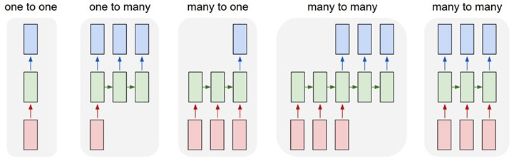

# python3
* star operator
* map zip lambda
* NDArray Indexing
https://docs.scipy.org/doc/numpy/user/basics.indexing.html

# pytorch


## RNN
Refer to https://pytorch.org/docs/stable/nn.html#lstm

Andrej Karpathy’s diagram shows the different pattern in RNN        


### Sequence 
The following code show the concept about sequence. 
torch.nn.LSTM can handle the sequence automatically, but we can feed it step-by-step also.  

```python
import torch

input_size = 10
hidden_size = 20
num_layers = 1

# model
model = torch.nn.LSTM(input_size, hidden_size, num_layers)

# data
input = torch.ones(4, 1, 10)

# option1: sequence
output, hidden = model(input)

# option2: step by step
input_0 = input[0,:,:].view(1,1,10)
input_1 = input[1,:,:].view(1,1,10)
input_2 = input[2,:,:].view(1,1,10)
input_3 = input[3,:,:].view(1,1,10)

output_0, hidden_0 = model(input_0)
output_1, hidden_1 = model(input_1, hidden_0)
output_2, hidden_2 = model(input_2, hidden_1)
output_3, hidden_3 = model(input_3, hidden_2)


print(hidden)
print(output)
print(hidden_0, hidden_1, hidden_2,hidden_3)
print(output_0, output_1, output_2,output_3)


# compare option1 & option2
print ((output[0]==output_0).sum().item() == hidden_size)
print ((output[1]==output_1).sum().item() == hidden_size)
print ((output[2]==output_2).sum().item() == hidden_size)
print ((output[3]==output_3).sum().item() == hidden_size)

"""
True
True
True
True
"""
# relation between hidden & output
print ((output[0]==hidden_0[0][-1]).sum().item() == hidden_size)
print ((output[1]==hidden_1[0][-1]).sum().item() == hidden_size)
print ((output[2]==hidden_2[0][-1]).sum().item() == hidden_size)
print ((output[3]==hidden_3[0][-1]).sum().item() == hidden_size)
"""
True
True
True
True
"""
```

As the result of the above code shown   
1. the output contains all outputs of each iteration.
2. the output is the collection of hidden state of each iteration
3. from the last layer of the LSTM (in much layer network, see the official document)


### Batch Processing
In fact, pytorch handle data in batch.  
It's more quickly, and save time.

```python
import torch

input_size = 10
hidden_size = 20
num_layers = 1

# model
model = torch.nn.LSTM(input_size, hidden_size, num_layers)

# data
input = torch.randn(4, 4, 10)

# option1: sequence
output, hidden = model(input)

# option2: one by one
input_0 = input[:, 0, :].view(4,1,10)
input_1 = input[:, 1, :].view(4,1,10)
input_2 = input[:, 2, :].view(4,1,10)
input_3 = input[:, 3, :].view(4,1,10)

output_0, hidden_0 = model(input_0)
output_1, hidden_1 = model(input_1)
output_2, hidden_2 = model(input_2)
output_3, hidden_3 = model(input_3)

#compare
print((output[-1][0]- output_0[-1][0]).sum())
print((output[-1][1]- output_1[-1][0]).sum())
print((output[-1][2]- output_2[-1][0]).sum())
print((output[-1][3]- output_3[-1][0]).sum())
"""
tensor(8.1956e-08, grad_fn=<SumBackward0>)
tensor(3.2596e-09, grad_fn=<SumBackward0>)
tensor(9.1270e-08, grad_fn=<SumBackward0>)
tensor(5.1223e-08, grad_fn=<SumBackward0>)
"""

```
The above code process inputs in batch.
Output of shape is (seq_len, batch, num_directions * hidden_size)
We can get the output according to the seq and batch
output[i,j,:]: get the i iteration output of the sample j
output[-1,j,:] get the last output of the sample j

### Batch processing with variable length sequences
Many real cases need to handle variable length sequences.
E.g. in nlp, the sentence length is variable, the character count of a word is variable.

Pytorch introduce several helper functions to handle this.

helper functions
* torch.nn.utils.rnn.pack_sequence
* torch.nn.utils.rnn.pad_sequence
* torch.nn.utils.rnn.pad_packed_sequence
* torch.nn.utils.rnn.pack_padded_sequence

helper structure
* PackedSequence
  
```python
import torch
import numpy as np

from torch.nn.utils.rnn import pad_sequence, pack_sequence, pack_padded_sequence, pad_packed_sequence

input_size = 2
hidden_size= 5
num_layers = 1
nClasses = 10
nSamples = 10

a = torch.ones(3, input_size)
b = torch.ones(5, input_size)
c = torch.ones(7, input_size)

# pad
pad = pad_sequence([c,b,a])
print("pad result", pad.size())

# pack
pack = pack_sequence([c,b,a])
print("pack result:", pack.data.size(), pack.batch_sizes)

# pack_padded
pack_padded = pack_padded_sequence(pad, [7,5,3])
print("pack_padded result:", pack_padded.data.size(), pack_padded.batch_sizes)

# pad_packed
pad_packed_data, pad_packed_lengths = pad_packed_sequence(pack)
print("pad_packed result:", pad_packed_data.size() ,pad_packed_lengths)

# pattern

"""
prepare data/model/indices
"""

# data
inputs = []
targets = []
for idx in range(nSamples):
    # set random len of input , and set the len as target
    # input: ones(len, input_size)
    # target: len
    len = np.random.randint(nSamples)+1
    sample = torch.ones(len, input_size)
    inputs.append(sample)
    targets.append(len)

# model
model = torch.nn.LSTM(input_size, hidden_size, num_layers)
demo = torch.ones(10,1,  input_size)
print("sample sequence result", model(demo)[0])

# indices
sample_length = [x.size(0) for x in inputs]
_, indices_sorted = torch.sort(torch.LongTensor(sample_length), descending=True)
_, indices_restore = torch.sort(indices_sorted)

print("sample length:", sample_length)

"""
option1:
pre-process inputs
sort (inputs)-> pack(inputs) -> rnn -> unpack -> unsort(outputs)

targets <-> outputs  
"""
print("option1")

 

# sort inputs
inputs_sorted = [inputs[x] for x in indices_sorted]

# pack inputs
pack = pack_sequence(inputs_sorted)

# rnn ...
outputs, hidden = model(pack)

# unpack
output_unpacked, unpack_outputs_length = pad_packed_sequence(outputs)
last_state = output_unpacked[unpack_outputs_length-1, [x for x in range(10)] ,:]

# unsort
unsorted_last_state = last_state[indices_restore,:]
print([(tup[0].size(0), tup[1], tup[2]) for tup in   zip(inputs, targets, unsorted_last_state)])

"""
option2 
pre-process (inputs, targets)
sort (inputs, targets)-> pack(inputs) -> rnn -> unpack

targets(sorted) <--> outputs  
"""

print("option2")
batch = list(zip(inputs, targets))

# sort inputs
batch_sorted = [batch[x] for x in indices_sorted]

# pack inputs
pack = pack_sequence([tup[0] for tup in batch_sorted])

# rnn ...
outputs, hidden = model(pack)

# unpack
output_unpacked, unpack_outputs_length = pad_packed_sequence(outputs)
last_state = output_unpacked[unpack_outputs_length-1, [x for x in range(10)] ,:]

print([(tup[0][0].size(0), tup[0][1], tup[1]) for tup in zip(batch_sorted, last_state)])

"""
pad result torch.Size([7, 3, 2])
pack result: torch.Size([15, 2]) tensor([3, 3, 3, 2, 2, 1, 1])
pack_padded result: torch.Size([15, 2]) tensor([3, 3, 3, 2, 2, 1, 1])
pad_packed result: torch.Size([7, 3, 2]) tensor([7, 5, 3])
sample sequence result tensor(
		[[[ 0.0121,  0.0403, -0.0511, -0.0392,  0.2119]],
        [[ 0.0203,  0.0604, -0.0728, -0.0546,  0.2866]],
        [[ 0.0248,  0.0718, -0.0820, -0.0617,  0.3169]],
        [[ 0.0271,  0.0784, -0.0860, -0.0653,  0.3302]],
        [[ 0.0283,  0.0823, -0.0877, -0.0673,  0.3362]],
        [[ 0.0288,  0.0847, -0.0884, -0.0685,  0.3390]],
        [[ 0.0291,  0.0860, -0.0887, -0.0693,  0.3403]],
        [[ 0.0293,  0.0868, -0.0887, -0.0698,  0.3409]],
        [[ 0.0294,  0.0873, -0.0887, -0.0701,  0.3412]],
        [[ 0.0294,  0.0876, -0.0887, -0.0704,  0.3413]]],
       grad_fn=<CatBackward>)
sample length: [9, 7, 10, 8, 6, 8, 5, 3, 5, 5]
option1
[(9, 9, tensor([ 0.0294,  0.0873, -0.0887, -0.0701,  0.3412], grad_fn=<SelectBackward>)), 
(7, 7, tensor([ 0.0291,  0.0860, -0.0887, -0.0693,  0.3403], grad_fn=<SelectBackward>)), 
(10, 10, tensor([ 0.0294,  0.0876, -0.0887, -0.0704,  0.3413], grad_fn=<SelectBackward>)), 
(8, 8, tensor([ 0.0293,  0.0868, -0.0887, -0.0698,  0.3409], grad_fn=<SelectBackward>)), 
(6, 6, tensor([ 0.0288,  0.0847, -0.0884, -0.0685,  0.3390], grad_fn=<SelectBackward>)), 
(8, 8, tensor([ 0.0293,  0.0868, -0.0887, -0.0698,  0.3409], grad_fn=<SelectBackward>)), 
(5, 5, tensor([ 0.0283,  0.0823, -0.0877, -0.0673,  0.3362], grad_fn=<SelectBackward>)), 
(3, 3, tensor([ 0.0248,  0.0718, -0.0820, -0.0617,  0.3169], grad_fn=<SelectBackward>)), 
(5, 5, tensor([ 0.0283,  0.0823, -0.0877, -0.0673,  0.3362], grad_fn=<SelectBackward>)), 
(5, 5, tensor([ 0.0283,  0.0823, -0.0877, -0.0673,  0.3362], grad_fn=<SelectBackward>))]

option2
[(10, 10, tensor([ 0.0294,  0.0876, -0.0887, -0.0704,  0.3413], grad_fn=<SelectBackward>)), 
(9, 9, tensor([ 0.0294,  0.0873, -0.0887, -0.0701,  0.3412], grad_fn=<SelectBackward>)), 
(8, 8, tensor([ 0.0293,  0.0868, -0.0887, -0.0698,  0.3409], grad_fn=<SelectBackward>)), 
(8, 8, tensor([ 0.0293,  0.0868, -0.0887, -0.0698,  0.3409], grad_fn=<SelectBackward>)), 
(7, 7, tensor([ 0.0291,  0.0860, -0.0887, -0.0693,  0.3403], grad_fn=<SelectBackward>)), 
(6, 6, tensor([ 0.0288,  0.0847, -0.0884, -0.0685,  0.3390], grad_fn=<SelectBackward>)), 
(5, 5, tensor([ 0.0283,  0.0823, -0.0877, -0.0673,  0.3362], grad_fn=<SelectBackward>)), 
(5, 5, tensor([ 0.0283,  0.0823, -0.0877, -0.0673,  0.3362], grad_fn=<SelectBackward>)), 
(5, 5, tensor([ 0.0283,  0.0823, -0.0877, -0.0673,  0.3362], grad_fn=<SelectBackward>)), 
(3, 3, tensor([ 0.0248,  0.0718, -0.0820, -0.0617,  0.3169], grad_fn=<SelectBackward>))]
"""
```
The sample sequence result show the result of sample[1,1,1,1,1,1,1,1,1,1], so we can get the output of each iteration .
In option 1: the outputs' order are restored, and it's the same as the orgin data
In option 2: the outputs' order are sorted(not restored), and it's the same as the sorted data

# refs

https://www.pythonlikeyoumeanit.com/intro.html
 https://djosix.github.io/Variable-Sequence-Lengths-for-PyTorch-RNNs/
 https://medium.com/understand-the-python/understanding-the-asterisk-of-python-8b9daaa4a558