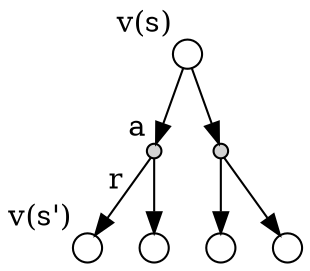

# Key points

- state action relation 
This describe the relation between state and action. 
    - $ v_\pi(s) = \sum_{a \in \mathcal{A}} \pi(a|s) q_\pi(s,a)  $
    - $ q_\pi(s,a) = \mathcal{R}_s^a + \gamma \sum_{s' \in \mathcal{S}} \mathcal{P}_{ss'}^a v_\pi(s') $
  

- Bellman equation
Bellman equation is the key to the MDP, and it describe the relation of the elements in MDP  
    $ <\mathcal{S}, \mathcal{A}, \mathcal{P}, \mathcal{R}, \gamma> $       
    $ v_\pi = \mathcal{R}_\pi + \gamma \mathcal{P}_\pi v  $       

state-value function and action-value function can be described recursivly according to the state-action relation equation      
    - state-value function $ v_\pi(s)  = \sum_{a \in \mathcal{A}} \pi(a|s)  (\mathcal{R}_s^a + \gamma \sum_{s' \in \mathcal{S}} \mathcal{P}_{ss'}^a v_\pi(s') ) $        
    - action-value function $ q_\pi(s,a)  = \mathcal{R}_s^a + \gamma \sum_{s' \in \mathcal{S}} \mathcal{P}_{ss'}^a \sum_{a \in \mathcal{A}} \pi(a'|s') q_\pi(s',a') $     

- Optimal Policy    
The way to find a policy $ \pi_*$ over $ \pi $  
$ 
\pi_*(a|s) = 
\begin{cases}
    1, & \text{if }  a= \operatorname*{arg\,max}\limits_{a \in \mathcal{A}} q_*(s,a))    \\
    0, & \text{otherwise}
\end{cases}
$ 
$  v_*(s) = \max\limits_a q_* (s,a)  \ \ \ \ \    q_*(s,a) = R_s^a + \gamma\sum_{s' \in \mathcal{S}} \mathcal{P}_{ss'}^a v_*(s') $        
Then we get the following optimal policy            
    - state-value function: $ v_*(s) = \max\limits_a R_s^a + \gamma\sum_{s' \in \mathcal{S}} \mathcal{P}_{ss'}^a v_*(s') $
    - action-value function: $ q_*(s,a) = R_s^a + \gamma\sum_{s' \in \mathcal{S}} \mathcal{P}_{ss'}^a \max\limits_a' q_*(s',a') $  

# Lecture Notes   
## Markov Processes
A state $S_t$ is Markov if and only if $ \mathbb{P}[S_{t+1} | s_t] = \mathbb{P}[S_{t+1}|S_1, ... , S_t] $   
A Markov Process (or Markov Chain) is a tuple $ <\mathcal{S}, \mathcal{P}> $

- $\mathcal{S}$ is a (finite) set of states
- $\mathcal{P}$ is a state transition probability matrix  
  $ \mathcal{P} = \mathbb{P}[S_{t+1} = s' | S_t = s] $
 
## Markov Reward Processes
### definition
A Markov reward process is a Markov chain with values.  
A Markov Reward Process is a tuple  $ <\mathcal{S}, \mathcal{P}, \mathcal{R}, \gamma> $   

- $ \mathcal{S} $ is a finite set of states   
- $ \mathcal{P} $ is a state transition probability matrix,       
  $ \mathcal{P}_{ss'} = \mathbb{P}[S_{t+1} = s' | S_t = s] $  
- $ \mathcal{R} $ is a reward function,       
  $ \mathcal{R}_s =  \mathbb{E}[R_{t+1} | S_t=s]$   
- $ \gamma $ is a discount factor,  $ \gamma \in [0,1]$     

### Return  
The return Gt is the total discounted reward from time-step t.  
$ G_t = R_{t+1} +  R_{t+2} + ... = \sum_{k=0} ^\infty \gamma^kR_{t+k+1} $     

### Value Function
The state value function v(s) of an MRP is the expected return starting from state s    
$  v(s) = \mathbb{E}[G_t | S_t =s] $    

### Bellman Equation for MRPs
$ 
\begin{align*}
    v(s) &= \mathbb{E}[G_t | S_t =s]  \\ 
         &= \mathbb{E}[R_{t+1} + \gamma v(S_{t+1}) | S_t =s]     \\     
         &= \mathcal{R}_s + \gamma \sum_{s' \in \mathcal{S}} \mathcal{P}_{ss'} v(s')
\end{align*}    
$  

### Bellman Equation in Matrix Form  
$ 
\begin{align*}
v &= \mathcal{R} + \gamma \mathcal{P}v \\
v &= (1-\gamma\mathcal{P})^{-1}\mathcal{R}
\end{align*}
$    
$ 
\begin{bmatrix}
    v_{1} \\
    \vdots \\
    v_{m}  
\end{bmatrix} = 
\begin{bmatrix}
    \mathcal{R}_{1} \\
    \vdots \\
    \mathcal{R}_{m}  
\end{bmatrix} + r
\begin{bmatrix}
    \mathcal{P}_{11} \dots \mathcal{P}_{1n} \\
    \vdots \\
    \mathcal{P}_{n1} \dots \mathcal{P}_{nn}  
\end{bmatrix} 
\begin{bmatrix}
    v_{1} \\
    \vdots \\
    v_{m}  
\end{bmatrix} 
$

## Markov Decision Processes
### definition
A Markov decision process (MDP) is a Markov reward process with decisions.  
It is an environment in which all states are Markov.    
A Markov Decision Process is a tuple  $ <\mathcal{S}, \mathcal{A}, \mathcal{P}, \mathcal{R}, \gamma> $    

- $ \mathcal{S} $ is a finite set of states   
- $ \mathcal{A} $ is a finite set of actions
- $ \mathcal{P} $ is a state transition probability matrix,       
  $ \mathcal{P}_{ss'}^a = \mathbb{P}[S_{t+1} = s' | S_t=s, A_t = a] $  
- $ \mathcal{R} $ is a reward function,       
  $ \mathcal{R}_s^a =  \mathbb{E}[R_{t+1} | S_t=s, A_t = a] $   
- $ \gamma $ is a discount factor,  $ \gamma \in [0,1]$  

### policy
A policy $ \pi $ is a distribution over actions given states,     
$ \pi(a|s) =\mathbb{P}[A_t=a|S_t=s] $     
Policies are stationary (time-independent),     
$ A_t \sim \pi(\cdot|S_t) $

- Given an MDP $ \mathcal{M} = <\mathcal{S}, \mathcal{A}, \mathcal{P}, \mathcal{R}, \gamma> $
- The state sequence $ S_1, S_2, S_3, \dots $ is a Markov process $ <\mathcal{S}, \mathcal{P^\pi}> $
- The state and reward sequence $ S_1, S_2, S_3, \dots $ is a Markov reward process  $ <\mathcal{S}, \mathcal{P}^\pi, \mathcal{R}^\pi, \gamma> $   
- where
$
\begin{align*}
    \mathcal{P}_{ss'}^\pi &= \sum_{a \in \mathcal{A}} \pi(a|s)  \mathcal{P}_{ss'}^a \\
    \mathcal{R}_{s}^\pi &= \sum_{a \in \mathcal{A}} \pi(a|s)  \mathcal{R}_{s}^a
\end{align*}
$

### value function
The state-value function $ v_\pi(s) $  of an MDP is the expected return starting from state s, and then following policy $ \pi $    
$  v_\pi(s) = \mathbb{E}_\pi[G_t | S_t =s] $    

The action-value function $ q_\pi(s,a) $ is the expected return starting from state s, taking action a, and then following policy $ \pi $   
$  q_\pi(s,a) = \mathbb{E}_\pi[G_t | S_t =s,A_t=a] $    

### Bellman Expectation Equation
**state-value function**       
$ 
\begin{align*}
v_\pi(s) &=\mathbb{E}_\pi[R_{t+1} + \gamma v_\pi(S_{t+1}) | S_t =s] \\
v_\pi(s) &= \sum_{a \in \mathcal{A}} \pi(a|s) q_\pi(s,a) \\
         &= \sum_{a \in \mathcal{A}} \pi(a|s)  (\mathcal{R}_s^a + \gamma \sum_{s' \in \mathcal{S}} \mathcal{P}_{ss'}^a v_\pi(s') ) 
\end{align*}
$  

**action-value function**   
$
\begin{align*}
q_\pi(s,a) &= \mathbb{E}_\pi[R_{t+1} + \gamma q_\pi(S_{t+1}, A_{t+1})| S_t =s,A_t=a] \\
q_\pi(s,a) &= \mathcal{R}_s^a + \gamma \sum_{s' \in \mathcal{S}} \mathcal{P}_{ss'}^a v_\pi(s') \\
           &= \mathcal{R}_s^a + \gamma \sum_{s' \in \mathcal{S}} \mathcal{P}_{ss'}^a \sum_{a \in \mathcal{A}} \pi(a'|s') q_\pi(s',a')
\end{align*}
$ 

### Bellman Equation in Matrix Form  
$ 
\begin{align*}
v_\pi &= \mathcal{R}_\pi + \gamma \mathcal{P}_\pi v \\
v_\pi &= (1-\gamma\mathcal{P}_\pi)^{-1}\mathcal{R}_\pi
\end{align*}
$    

### Optimal Value Function
#### definition
The optimal state-value function $ v_*(s)$ is the maximum value function over all policies    
$ v_*(s)=\max\limits_{\pi}v_{\pi}(s) $    
The optimal action-value function q⇤(s,a) is the maximum action-value function over all policies    
$ q_*(s,a)=\max\limits_{\pi}v_{\pi}(s,a) $    

- The optimal value function specifies the best possible performance in the MDP.
- An MDP is “solved” when we know the optimal value fn. 

#### Optimal policy
Define a partial ordering over policies
$ \pi \geqslant \pi' \ if\ v_\pi(s) \geqslant v_\pi'(s), \forall s $  
**Theorem** 
For any Markov Decision Process 

- There exists an optimal policy $ \pi_*$ that is better than or equal to all other policies,     
$ \pi_* \geqslant \pi, \forall \pi $
- All optimal policies achieve the optimal value function   
$ v_{\pi_*}(s) = v_*(s) $
- All optimal policies achieve the optimal action-value function    
$ q_{\pi_*}(s,a) = q_*(s,a) $

#### Finding an Optimal Policy

An optimal policy can be found by maximising over $ q_*(s,a) $,   
$ 
\pi_*(a|s) = 
\begin{cases}
    1, & \text{if }  a= \operatorname*{arg\,max}\limits_{a \in \mathcal{A}} q_*(s,a))    \\
    0, & \text{otherwise}
\end{cases}
$ 

- There is always a deterministic optimal policy for any MDP 
- If we know $ q_*(s,a) $, we immediately have the optimal policy

$  
v_*(s) = \max\limits_a q_* (s,a)  \ \ \ \ \    q_*(s,a) = R_s^a + \gamma\sum_{s' \in \mathcal{S}} \mathcal{P}_{ss'}^a v_*(s') \\ 
v_*(s) = \max\limits_a R_s^a + \gamma\sum_{s' \in \mathcal{S}} \mathcal{P}_{ss'}^a v_*(s') \\ 
q_*(s,a) = R_s^a + \gamma\sum_{s' \in \mathcal{S}} \mathcal{P}_{ss'}^a \max\limits_a' q_*(s',a')
$  

### Solving the Bellman Optimality Equation
- Bellman Optimality Equation is non-linear 
- No closed form solution (in general) 
- Many iterative solution methods
    - Value Iteration 
    - Policy Iteration 
    - Q-learning 
    - Sarsa

## Extensions to MDPs
...
