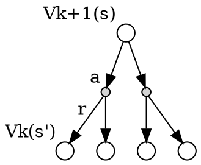

# Key Points
Dynamic programming assumes full knowledge of the MDP

**value evaluation**        
given MDP and policy $\pi$, compute the state value $v_\pi$  
just follows the bellmen equation , and compute value of each state iteratively   
$
\begin{align*}
v_{k+1}(s)  &= \sum_{a \in \mathcal{A}} \pi(a|s)  (\mathcal{R}_s^a + \gamma \sum_{s' \in \mathcal{S}} \mathcal{P}_{ss'}^a v_k(s') ) \\
v_{k+1} &= \mathcal{R}^\pi + \gamma \mathcal{P}^\pi v_k
\end{align*}
$   

**policy optimality**       
given MDP, compute the optimal policy $\pi_*$           

- Policy iteration       
Policy iteration try to find the optimal policy $\pi_*$ by improving the current policy $\pi$ step-by-step      
The key is greedy algorithm     
$ \pi'(s) = \operatorname*{arg\,max}\limits_{a \in \mathcal{A}} q_\pi(s,a))$      

- Value iteration             
Value iteration try to find the optimal policy $\pi_*$ by the known solutions to the sub problems                     
It is different to the policy iteration, and there is no explicit policy     
The key is compute state value from all the successor states(the known solution of the subproblem)          
$ 
\begin{align*} v_{k+1}(s) &= \max\limits_{a \in \mathcal{A}} (\mathcal{R}_s^a + \gamma\sum_{s' \in \mathcal{S}} \mathcal{P}_{ss'}^a v_*(s') ) \\
                  v_{k+1} &= \max\limits_{a \in \mathcal{A}} (\mathcal{R}^a + \gamma\mathcal{P}^av_k) 
\end{align*} 
$

# Lecture 
## Introduction
Dynamic Programming is a very general solution method forproblems which have two properties:

- Optimal substructure
    - Principle of optimality applies
    - Optimal solution can be decomposed into subproblems
- Overlapping subproblems
    - Subproblems recur many times
    - Solutions can be cached and reused
- Markov decision processes satisfy both properties
    - Bellman equation gives recursive decomposition
    - Value function stores and reuses solutions

## Policy Evaluation

### definition

- Problem:  evaluate a given policy       
- Solution:  iterative application of Bellman expectation backup        
$ v_1 -> v_2 -> v_3 $             
- Using synchronous backups,          
    - At each iterationk+ 1
    - For all statess $ s \in \mathcal{S} $
    - Update $ v_{k+1}(s) $ from   $ v_{k}(s')$ wheres $s'$ is a sucdessor state of s

### equation

$
\begin{align*}
v_{k+1}(s)  &= \sum_{a \in \mathcal{A}} \pi(a|s)  (\mathcal{R}_s^a + \gamma \sum_{s' \in \mathcal{S}} \mathcal{P}_{ss'}^a v_k(s') ) \\
v_{k+1} &= \mathcal{R}^\pi + \gamma \mathcal{P}^\pi v_k
\end{align*}
$         

## Policy Iteration
### definition
- Given a policy $ \pi $
    - Evaluate the policy $ \pi $ 
    $ v_\pi(s) = \mathcal{E}[R_{t+1} + \gamma$_{t+2} + ... | S_t=s ]$     
    - Improve the policy by acting greedily with respect to $ v_\pi $     
    $ \pi' = greedy(v_\pi) $

 

### policy improvement

- Consider a deterministic policy, $ a=\pi(s)$      
- We can improve the poilcy by acting greedily        
$ \pi'(s) = \operatorname*{arg\,max}\limits_{a \in \mathcal{A}} q_\pi(s,a))$      
- This improves the value from any state s over one step      
$ q_\pi(s, \pi'(s)) = \max\limits_{a \in \mathcal{A}} q_\pi (s,a)   \geqslant q_\pi(s, \pi(s)) = v_\pi(s) $       
- It therefore improves the value function, $ v_\pi'(s) \geqslant v_\pi(s) $      
$
\begin{align*}
v_\pi(s)& \leqslant q_\pi(s,\pi'(s))   \\
        & \leqslant \mathbb{E}_{\pi'}[R_{t+1} + \gamma v_\pi(S_{t+1}) | S_t = s]    \\
        & \leqslant \mathbb{E}_{\pi'}[R_{t+1} + \gamma q_\pi(S_{t+1}, \pi'(S_{t+1})) | S_t = s]    \\
        & \leqslant \mathbb{E}_{\pi'}[R_{t+1} + \gamma R_{t+2} + \gamma^2 q_\pi(S_{t+2}, \pi'(S_{t+2})) | S_t = s]    \\
        & \leqslant \mathbb{E}_{\pi'}[R_{t+1} + \gamma R_{t+2} + \dots| S_t = s]    \\
        &= v_{\pi'}(s)
\end{align*}
$
- if improvements stop,     
$ q_\pi(s, \pi'(s)) = \max\limits_{a \in \mathcal{A}} q_\pi (s,a) = q_\pi(s, \pi(s)) = v_\pi(s) $         
- Then the Bellman optimality equation has been satisfied           
$ v_\pi(s) \max\limits_{a \in \mathbb{A}} q_\pi(s,a) $  
- Therefore $ v_\pi(s) v_*(s)  \text{   for all} s \in \mathbb(S) $       
- so $\pi$ is an optimal policy

### extensions to policy iteration

 


## Value Iteration

### definition
- Problem:  find optimal policy $\pi$     
- Solution:  iterative application of Bellman optimality backup        
$ v_1 -> v_2 -> \dots -> v_* $             
- Using synchronous backups,          
    - At each iteration k+1
    - For all statess $ s \in \mathcal{S} $
    - Update $ v_{k+1}(s) $ from   $ v_{k}(s')$ 
- Convergence to $v_*$  
- **Unlike policy iteration, there is no explicit policy**
- Intermediate value functions may not correspond to any policy

### Principle of Optimality
Any optimal policy can be subdivided into two components

- An optimal first action $A_*$
- Followed by an optimal policy from successor state $\mathbb{S}'$        

**Theorem**     
A policy $ \pi(a|s)$ achieves the optimal value from state s, $v_\pi(s) = v_*(s)$, if and only if            

- For any state $s'$ reachable from s     
- $\pi$ achieves the optimal value from state $s'$, $ v_\pi(s') = v_*(s') $       

so if we know the subproblem's solution $v_*(s')$,$v_*(s)$ can be found by one-step lookahead       
$ v_*(s) <- \max\limits_{a \in \mathbb{A}} R_s^a + \gamma\sum_{s' \in \mathcal{S}} \mathcal{P}_{ss'}^a v_*(s') $

Here is the final algorithm:        
$
\begin{align*}
v_{k+1}(s) &= \max\limits_{a \in \mathcal{A}} (\mathcal{R}_s^a + \gamma\sum_{s' \in \mathcal{S}} \mathcal{P}_{ss'}^a v_*(s')  ) \\ 
v_{k+1}    &= \max\limits_{a \in \mathcal{A}} (\mathcal{R}^a + \gamma\mathcal{P}^av_k)
\end{align*}
$


## Extensions to Dynamic Programming
## Contraction Mapping

# Excises
## Policy Evaluation Solution
[algorithm](https://github.com/zhoumingjun/reinforcement-learning/blob/master/DP/Policy%20Evaluation%20Solution%202.ipynb)          
This is a modified version, and I only make the bellman_equation as a function to make it easier to understand.                 
The key is the bellman equation .           

$
\begin{align*}
v_{k+1}(s)  &= \sum_{a \in \mathcal{A}} \pi(a|s)  (\mathcal{R}_s^a + \gamma \sum_{s' \in \mathcal{S}} \mathcal{P}_{ss'}^a v_k(s') ) \\
v_{k+1} &= \mathcal{R}^\pi + \gamma \mathcal{P}^\pi v_k
\end{align*}
$  

```python
def bellman_equation(policy, env, V, s, gamma ):
    """
    compute the state value according to the ballman equation

    Args:
        policy: [S, A] shaped matrix representing the policy.
        env: OpenAI env. env.P represents the transition probabilities of the environment.
            env.P[s][a] is a (prob, next_state, reward, done) tuple.
        V: the values of the states
        s: the state,
        gamma: gamma discount factor.

    Returns:
        the value of the state s
    """    
    v = 0
    for action, action_prob in enumerate(policy[s]):
        for  state_transition_prob, next_state, reward, done in env.P[s][action]:
            # Calculate the expected value
            v += action_prob * state_transition_prob * (reward + gamma * V[next_state])
    return v
```

some explanation:   

- action_prob 
    action_prob is action probability, which is  $\pi(a|s)$  
- state_transition_prob    
    state_transition_prob is state transition probability, which is $P_(ss')^\pi$

## policy iteration
[algorithm](https://github.com/zhoumingjun/reinforcement-learning/blob/master/DP/Policy%20Iteration%20Solution%202.ipynb)          
The key is the greedy algorithm, that is    
$ \pi'(s) = \operatorname*{arg\,max}\limits_{a \in \mathcal{A}} q_\pi(s,a))$

```python
def greedy(env, policy, V, discount_factor=1.0):
    policy_stable = True
    for s in range(env.nS):
        # The best action we would take under the currect policy
        chosen_a = np.argmax(policy[s])

        # Find the best action by one-step lookahead
        # Ties are resolved arbitarily
        action_values = np.zeros(env.nA)
        for a in range(env.nA):
            for prob, next_state, reward, done in env.P[s][a]:
                action_values[a] += prob * (reward + discount_factor * V[next_state])
        best_a = np.argmax(action_values)

        # Greedily update the policy
        if chosen_a != best_a:
            policy_stable = False
        policy[s] = np.eye(env.nA)[best_a]
        
    return   policy , policy_stable
```        

## value iteration
The key is one_step_lookahead, that is compute the max value of the state from all the successor states

$ 
\begin{align*} v_{k+1}(s) &= \max\limits_{a \in \mathcal{A}} (\mathcal{R}_s^a + \gamma\sum_{s' \in \mathcal{S}} \mathcal{P}_{ss'}^a v_*(s') ) \\
                  v_{k+1} &= \max\limits_{a \in \mathcal{A}} (\mathcal{R}^a + \gamma\mathcal{P}^av_k) 
\end{align*} 
$
```python
    def one_step_lookahead(state, V):
        """
        Helper function to calculate the value for all action in a given state.
        
        Args:
            state: The state to consider (int)
            V: The value to use as an estimator, Vector of length env.nS
        
        Returns:
            A vector of length env.nA containing the expected value of each action.
        """
        A = np.zeros(env.nA)
        for a in range(env.nA):
            for prob, next_state, reward, done in env.P[state][a]:
                A[a] += prob * (reward + discount_factor * V[next_state])
        return A

    A = one_step_lookahead(s, V)        
    best_action_value = np.max(A)        
```        